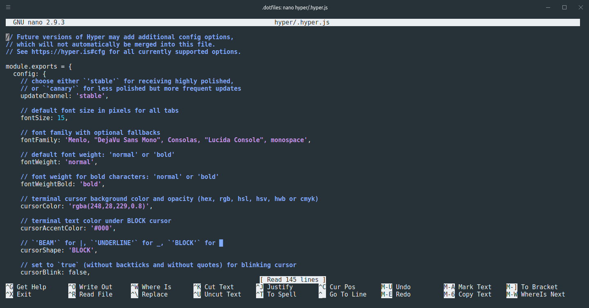

# Dotfiles (zsh, bash, hyper.js)

## Requirements
- zsh
- oh-my-zsh
- git

## Installation

### Linux 
- Install [Zplug](https://github.com/zplug/zplug)
- Clone this repository
- Backup the current `.zshrc` file and then delete it
- Create a symlink from `dotfiles/zsh/.zsh` to `~/.zshrc`
- Restart the shell and enjoy

## WSL
- Install [Antigen](https://github.com/zsh-users/antigen)
- Repeat step 2 and 3 in Linux section
- Create a symlink from `dotfiles/zsh/.zsh.wsl` to `~/.zshrc`
- Backup the current `.bashrc` file and then delete it
- Create a symlink from `dotfiles/bash/.bashrc` to `~/.bashrc`
- Restart the shell and enjoy

*Note: if zsh complains about "insecure directories" in WSL, follow this [instructions](https://github.com/zsh-users/zsh-completions/issues/433)*
